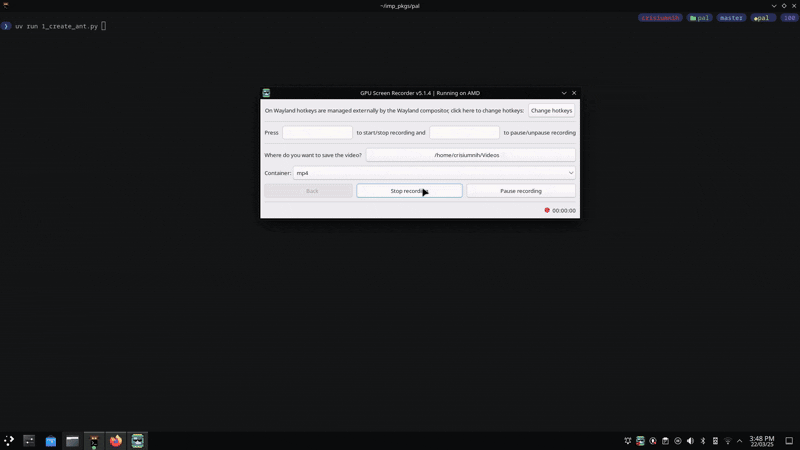
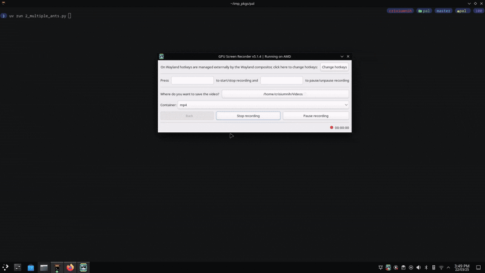
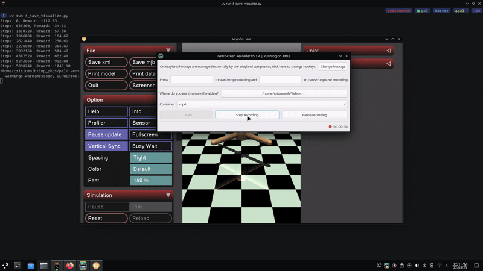

# MuJoCo-Brax Tasks for PAL Robotics

### Package Management with UV

This project uses `UV` as the package manager instead of `pip`.

- **Installing Dependencies:**
```bash
uv pip install [dependency]
```
- **Running the file**
```bash
uv run 1_create_ant.py
```

## Task 1: Simulating the Ant Robot in MuJoCo
Using MuJoCo, a simulation of the Ant robot is created, applying random controls to its joints and rendering it in `mujoco.viewer`.

### **Key Methods:**
- **Loading the Model:**
  ```python
  model = mujoco.MjModel.from_xml_string(xml_string)
  data = mujoco.MjData(model)
  ```
- **Launching the Viewer:**
  ```python
  with mujoco.viewer.launch_passive(model, data) as viewer:
  ```
- **Applying Random Controls:**
  ```python
  data.ctrl[:] = np.random.uniform(-1, 1, size=model.nu)
  ```
- **Stepping the Simulation:**
  ```python
  mujoco.mj_step(model, data)
  ```

### **Simulation Output:**


## Task 2: Replicating Multiple Ant Robots in MuJoCo
A function is implemented to replicate the Ant robot multiple times in the same MuJoCo model, positioning them in a grid. Each robot is controlled independently with random actions.

### **Key Methods:**
- **Replicating the Model:**
```python
def replicate(num_envs, env_separation, envs_per_row, xml_string):
```
- **Creating a Ground Plane:**
```python
new_spec.worldbody.add_geom(
type=mujoco.mjtGeom.mjGEOM_PLANE, size=[20, 20, .1], material='grid')
```
- **Placing Models in a Grid:**
```python
row, col = divmod(i, envs_per_row)
x_pos, y_pos = col * env_separation, row * env_separation
frame = new_spec.worldbody.add_frame(pos=[x_pos, y_pos, 0])
```
- **Controlling All Models with Random Action:**
```python
data.ctrl[:] = np.random.uniform(-1, 1, size=model.nu)
```

- Earlier, The documentation recommended modifying XML files manually to assign unique IDs for each part. With `MjSpec`, this is handled automatically, making replication much easier.
- Another issue was that the original model remained, and each replication added one more instance instead of replacing it. To fix this, I had to create an entirely new environment and add the replicated models there.
- This also solves another task— Generalizing the replication function to work with any XML robot model, such as the orange humanoid from MuJoCo. The function correctly replicates different environments without modification.

### **Simulation Output:**


## Task 3: Training a PPO Policy for the Ant Robot in Brax
The Ant robot is trained using Brax's Proximal Policy Optimization (PPO) implementation. The training runs in a parallelized environment using JAX for hardware acceleration.

### **Key Methods:**
- **Initializing the Environment:**
```python
env = envs.get_environment(env_name="ant", backend="generalized")
```
- **Training the Policy:**
```python
make_inference_fn, params, _ = train_fn(environment=env)
```
- **Saving the Trained Model**
```python
model.save_params('ant_ppo_policy', params)
```

## Task 4: Saving and Testing the PPO Policy in MuJoCo  
The trained PPO policy from Brax is loaded and tested in a MuJoCo simulation. The actions predicted by the trained model are applied to the Ant robot in MuJoCo.

### **Key Methods:**  
- **Loading the Trained PPO Policy:**  
```python
params = model.load_params('ant_ppo_policy')
inference_fn = make_inference_fn(params)
jit_inference_fn = jax.jit(inference_fn)
```
- **Applying the Trained Policy Actions to MuJoCo**
```python
rng = jax.random.PRNGKey(0)
state = jax.jit(env.reset)(rng)

for _ in range(n_steps):
    act_rng, rng = jax.random.split(rng)
    ctrl, _ = jit_inference_fn(state.obs, act_rng)
    data_mj.ctrl[:] = np.array(ctrl) 
    mujoco.mj_step(model_mj, data_mj)
    viewer.sync()
    time.sleep(0.01)
```
### **Simulation Output:**


- Training for 50,000,000 time steps on an RTX 3050 Ti Mobile GPU took around 20 minutes.
- Reducing the number of steps made training faster but likely impacted convergence.
- Running on a faster GPU would improve training quality and stability.
